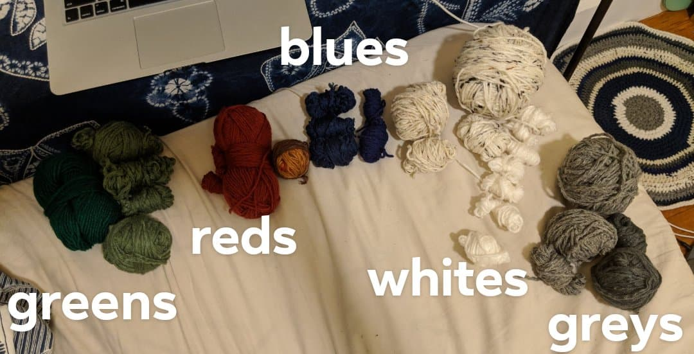
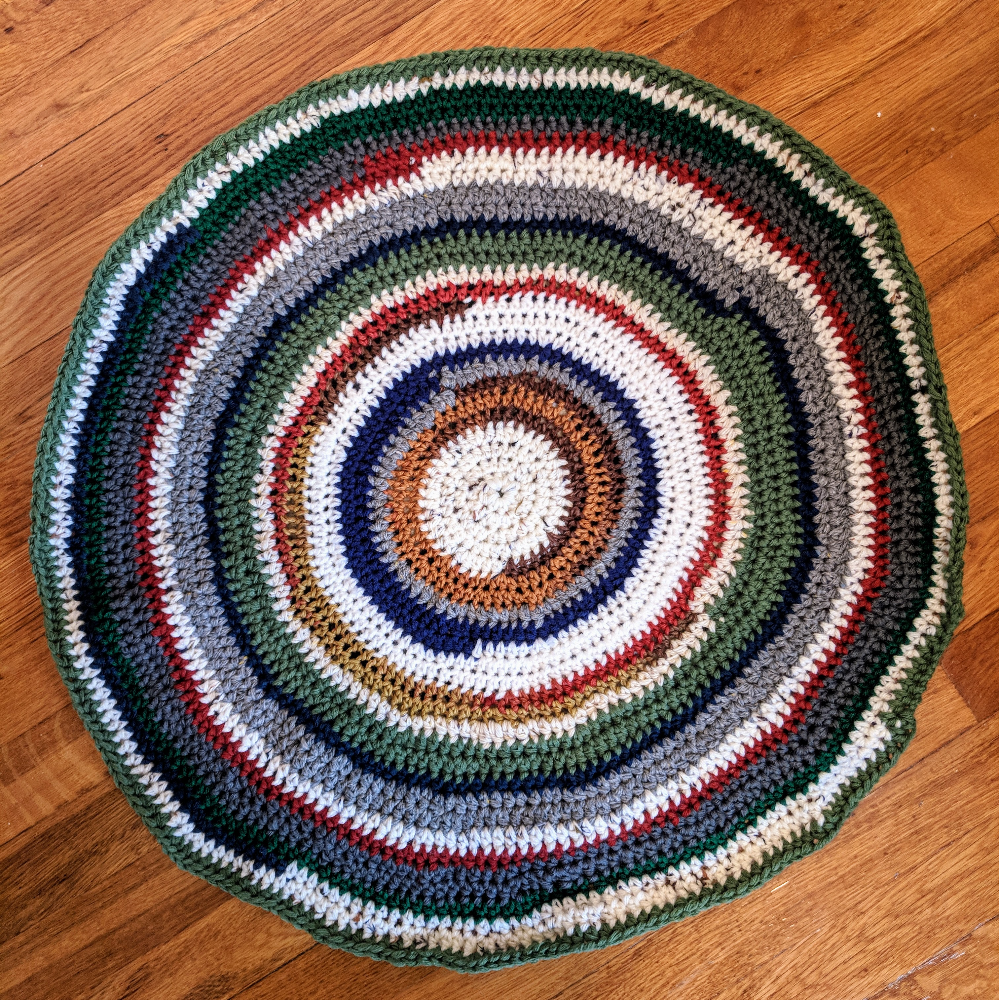

# Random crochet pattern generator

Really really simple program to choose a crochet pattern for me to follow,
given some basic rules about alternating colors.

### Rules:
1.  Can't crochet using two colors from the same color category next to each
    other
2.  Can't crochet using a color I've run out of
3.  Bias towards newness - there's a .75 chance that the next color will be
    in a different color category from the categories of the last three colors 
    chosen (unless this is not possible given the available stock of colors)

### Initial Colors:

### Final Project:

